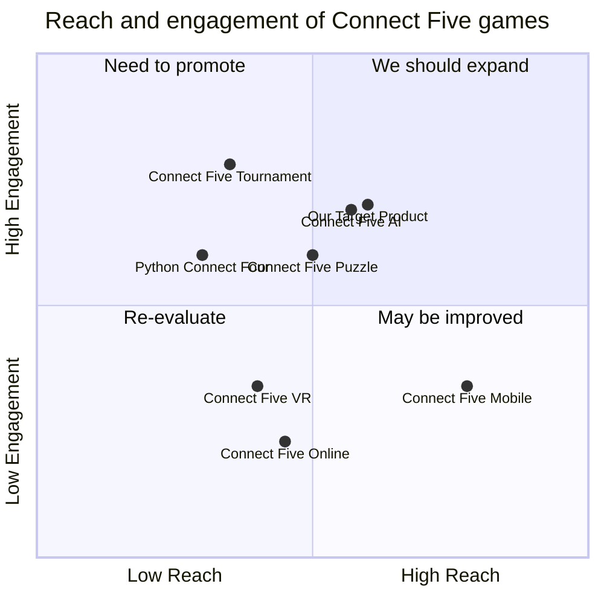

## Original Requirements:

The boss wants a CLI version of a Connect Five game.

## Product Goals:
```python
[
    "Create a CLI version of a Connect Five game",
    "Provide a user-friendly interface",
    "Ensure efficient gameplay"
]
```

## User Stories:
```python
[
    "As a player, I want to be able to start a new game",
    "As a player, I want to be able to place my piece on the board",
    "As a player, I want to be able to see the current state of the board",
    "As a player, I want to be able to win the game by connecting five pieces",
    "As a player, I want to be able to quit the game at any time"
]
```

## Competitive Analysis:
```python
[
    "Python Connect Four: A CLI version of the popular Connect Four game implemented in Python",
    "Connect Five Online: An online multiplayer version of Connect Five with a sleek user interface",
    "Connect Five AI: A Connect Five game with an AI opponent that provides a challenging gameplay experience",
    "Connect Five Mobile: A mobile version of Connect Five with intuitive touch controls",
    "Connect Five VR: A virtual reality version of Connect Five for an immersive gameplay experience",
    "Connect Five Tournament: An online tournament platform for competitive Connect Five matches",
    "Connect Five Puzzle: A puzzle-based version of Connect Five with unique challenges"
]
```

## Competitive Quadrant Chart:


## Requirement Analysis:
The product should be a CLI version of a Connect Five game with a user-friendly interface and efficient gameplay.

## Requirement Pool:
```python
[
    ("End game detection", "P0"),
    ("Input validation", "P1"),
    ("Board display", "P1"),
    ("Player turn management", "P2"),
    ("Quit game option", "P2")
]
```

## UI Design draft:
The UI design should include the following elements and functions:
- A welcome message with instructions on how to start a new game
- A command line prompt for the player to enter their moves
- A visual representation of the game board
- Clear and concise messages for game status updates (e.g., player turn, winner, draw)
- An option to quit the game at any time

The style should be minimalistic and easy to read, with a clear distinction between the player's piece and the empty spaces on the board. The layout should be organized and aligned, with the game board displayed in a grid format.

## Anything UNCLEAR:
There are no unclear points.