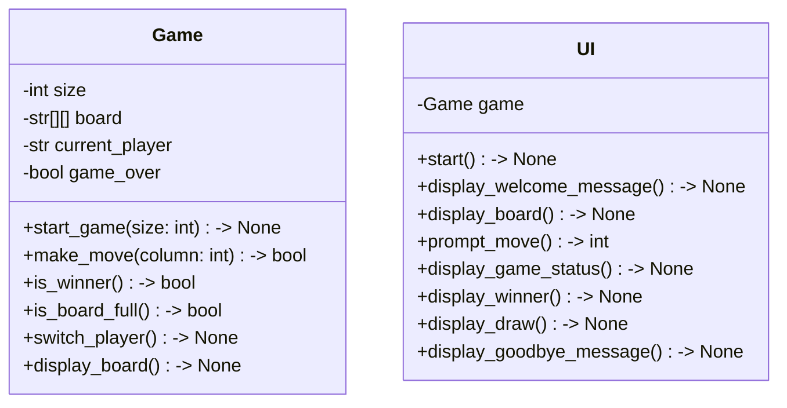

## Implementation approach:

To implement the CLI version of the Connect Five game, we will use the following approach:

1. Design the game logic: This includes creating the game board, managing player turns, validating inputs, and detecting the end of the game.

2. Implement the user interface: We will create a command-line interface that allows the player to interact with the game. This includes displaying the game board, prompting the player for their moves, and providing clear and concise messages for game status updates.

3. Test the game: We will write unit tests to ensure the correctness of the game logic and the user interface.

For this implementation, we will use the following open-source tools:

- Click: A Python package for creating command-line interfaces. It provides an easy-to-use and intuitive way to define command-line options and arguments.

- Pytest: A testing framework for Python. It allows us to write concise and readable tests for our game logic and user interface.

## Python package name:

```python
"connect_five_game"
```

## File list:

```python
[
    "main.py",
    "game.py",
    "ui.py",
    "tests/test_game.py",
    "tests/test_ui.py"
]
```

## Data structures and interface definitions:



## Program call flow:

```mermaid
sequenceDiagram
    participant M as Main
    participant G as Game
    participant U as UI

    M->>U: start()
    U->>U: display_welcome_message()
    U->>G: start_game(size)
    U->>U: display_board()
    loop until game over
        U->>U: prompt_move()
        U->>G: make_move(column)
        U->>G: switch_player()
        U->>U: display_board()
        U->>G: is_winner()
        alt if winner
            U->>U: display_winner()
            U->>U: display_goodbye_message()
            G->>M: end game
        else if board full
            U->>U: display_draw()
            U->>U: display_goodbye_message()
            G->>M: end game
    end
```

## Anything UNCLEAR:

The requirements are clear, and the implementation approach is straightforward.